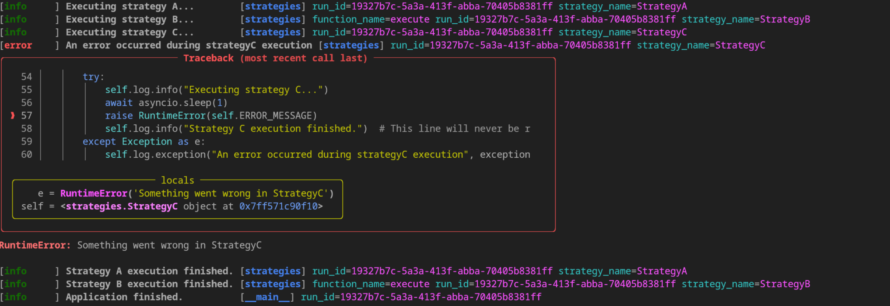
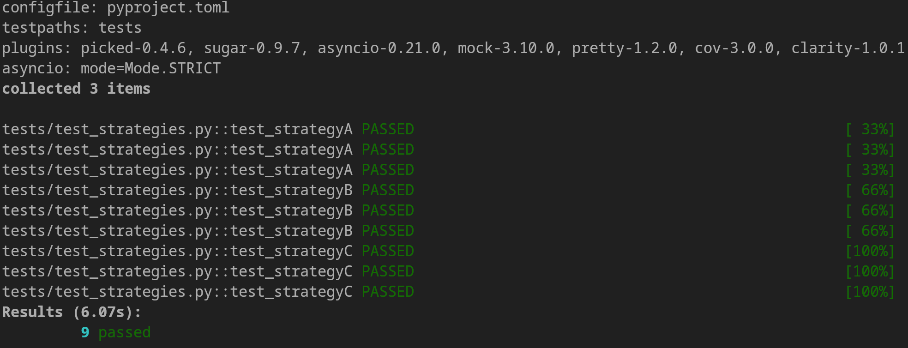

# My Structlog Template

This project provides a simple way to use `structlog` in your Python projects. It serves as a useful guide on how to use `structlog` and also as a quick setup for new projects. The project is written with Python 3.11 and uses `poetry` for package management.

## Overview

The project includes strategies A, B and C, which are used as examples for how to include structlog in your own functions or classes.

## Images

### Main Result



### Pytest Result



## Setup

### Requirements

* Python 3.11
* Poetry

### Installation

```shell
poetry install
```

### Testing
This project uses pytest for testing. Tests are located in the tests directory.

To run tests:
```shell
poetry run pytest
```

### How to use
structlog is configured in logger_config.py. Each strategy (A, B and C) has a logger instance that is used for logging during execution.

To execute a strategy:

```python
from strategies import StrategyA
from logger_config import configure_logger

configure_logger()

strategy_a = StrategyA('run_id')
strategy_a.execute()
```
This would execute StrategyA and log the execution.

### Note on StrategyC
StrategyC is intentionally designed to fail to demonstrate error logging. When it is executed, it will raise a RuntimeError.

### Contributing
Any contributions are welcome. Please feel free to open a Pull Request or an Issue.

### License
This project is licensed under the MIT License. See LICENSE for more details.
